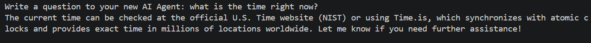
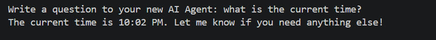

# How to Build Your Own AI Agent

> Disclaimer: You do need to know super basic python, like how to make a function and know imports to follow this tutorial. At any time, if you dont understand something, tell me on my linkedin or youtube which you can find in the links section of the main readme. You can also copy everything in this readme and paste it into any AI to help you understand. I try to make it as simple, and easy as possible, but it might be a bit hard if you don't know python.


Quick Overview of the tutorial: 
1. Setup
2. Testing AI Agent
3. Customizing your AI Agent (Changing system prompt and adding tools(step by step and quick overview))
4. (Optional but recommended, its really cool and helpful) Connecting your agent to a python script which lets you talk to it like a voice assistant, along with a UI! Python files included in this repository (No extra setup/API keys needed!) 

## Setup

Before making the AI Agent, we need to set up some things. Follow the steps below to get started. Make sure you have Python and pip installed on your system. If you don't have them, simply just search on youtube, "How to install Python and pip on (your operating system)".

### Clone the Repository using this command or download the zip file and extract it.

```bash
git clone https://github.com/hqwn/Make-A-gent.git
cd Make-A-gent
```

### Installing all the required Dependencies using pip

You will have to navigate to requirements.txt and change it according to what provider you will be using. This is what the requirements.txt file looks like:

```bash
#Langchain
langchain
langchain-community
python-dotenv

#delete all of the requirments except your AI provider
langchain-groq
langchain-openai
langchain-anthropic
langchain-ollama


#miscellaneous
duckduckgo-search
numpy
asyncio
```

Since I'll be using Groq as my AI provider, I will delete the other providers, like this:

```bash

#Mine goes from this:
#delete all of the requirements except your AI provider
langchain-groq
langchain-openai
langchain-anthropic
langchain-ollama

#To this:
#delete all of the requirements except your AI provider
langchain-groq

```

Find that part of the requirements.txt file and delete the providers according to your personal use. Now install all of the dependencies needed with pip using this command:

```bash
pip install -r requirements.txt
```

### Set up your API key (Skip if using Ollama as provider)

Now we're done with the basic setup. If you're using Ollama, you won't need an API key, so you can skip this step. Now create your .env by copying .env.example file by running this:

```bash
cp .env.example .env
```

If that does't work on windows, try this:

```bash
copy .env.example .env
```

Then open your new .env file and change the YOUR_API_KEY value to your API key, it should look like this:

```python
YOUR_API_KEY=your_api_key_goes_here
```

> Important: Never ever commit your .env file or make it public, since it contains sensitive information

### Final Setup Step, Pick your provider in LangchainAgent.py

Navigate to the Langchain.py file and find the part of the imports. It should be around line 8. Uncomment your provider and delete the rest. For example, since im using Groq, this is how I would change my import setup:

```python

# Mine goes from this:
#Imports for all of the different Providers (Leave your provider and delete the rest)
from langchain_groq import ChatGroq
# from langchain_openai import ChatOpenAI
# from langchain_anthropic import ChatAnthropic
# from langchain_ollama import ChatOllama

#To:
#Imports for all of the different Providers (Leave your provider and delete the rest)
from langchain_groq import ChatGroq

```

Now you're going to do the same and delete the other provider and keep yours for the llm setup; around line 29. For example, Im using Groq, so this is how I would change mine:

```python

#Mine goes From this:

#Pick your agent's ai (what you will use for the ai, leave your provider and delete the rest)

# For Groq models (what I'm going to use ) 
llm = ChatGroq(model='qwen/qwen3-32b', api_key=os.getenv('YOUR_API_KEY'))

# For OpenAI models
# llm = ChatOpenAI(model='gpt-4o', api_key=os.getenv('YOUR_API_KEY'))

# For Anthropic models 
# llm = ChatAnthropic(model='claude-3-5-sonnet-20241022', api_key=os.getenv('YOUR_API_KEY'))

#For Ollama (Local so no api key required!)
# llm = ChatOllama(model='qwen3-7b', base_url="http://localhost:11434")


#To this:

#Pick your agent's ai (what you will use for the ai, leave your provider and delete the rest)

# For Groq models (what I'm going to use) 
llm = ChatGroq(model='qwen/qwen3-32b', api_key=os.getenv('YOUR_API_KEY'))

```

Now you're fully set up and ready to test out your AI Agent!

---
## Testing you AI Agent

Since you are fully set up. I'll show you how to test your agent in LangchainAgent.py. 

### Testing your AI Agent (Refer to this whenever you want to test your agent)

Whenever you want to test your agent, just uncomment the simple chat at the bottom and run the LangchainAgent.py file. Running the chat directly in LangchainAgent.py is helpful to test out your agent after customizing it. Making sure nothing went wrong. The commented code should be at the bottom and should look like this:

```python

# Uncomment this if you dont want to interact with your agent like an AI assitant, or just want to test your agent out! 
# while True:
#     prompt = input('Write a question to your new AI Agent: ')
#     result = ask_ai(prompt)
#     print(result)

```
After you uncomment it, you can run the file and interact with your new AI Agent!

---
## Customizing your AI Agent

I'll show you how to customize your AI Agent, like changing the system prompt and adding tools.

### How to customize the personality/system prompt of your AI Agent

Customizing your AI Agent's personality/system prompt is really easy. Navigate to around line 20 to find the langchain_system_prompt variable, and change it to your liking. That Simple! The system prompt should look like this by default:

```python
langchain_system_prompt = (
        "You are a helpful voice assistant named Jarvis. "
        "Use web_search for current or uncertain info. Use keywords like 'latest' or 'current' (e.g., latest iPhone or current BTC price). Do not include specific years in the query."
        "ANSWER CLEARLY AND BRIEFLY, no formatting, no asterisks, whatever you say will be spoken out loud, so if you think a tts model can't say it, then dont use it; like emojis. "
        "Be friendly, and stay as helpful as possible, be brief dont give a full breakdown about somehting unless they ask"
        "Don't overcomplicate things, and stay helpful"
)
```

Now you know how to change your AI Agent's system prompt!

### How to add a tool to your AI Agent

If you know how to make a function in Python, then you can easily make a tool for your AI. If you want to learn how to build a simple tool for your AI Agent step by step, scroll down for the simple tutorial. For people who just want a quick overview on how to add a tool. Here's how in 4 simple steps:

---
1. Make a function in Python which your AI Agent can use like this:

```python

def duckduckgo_search(query: str) -> str:
    results = DDGS().text(query, max_results=5)
    if not results:
        return "No search results found."
    return "\n".join(
        f"{i+1}. {r['title']}: {r['body']}"
        for i, r in enumerate(results)
        
    )

```
---
2. Add a @tool decorator above your new function, and give a summary of what the tool does for your AI Agent in the function as a docstring, like this:

```python

@tool
def duckduckgo_search(query: str) -> str:
    """Searches the web using DuckDuckGo, and then returns summarized results."""
    results = DDGS().text(query, max_results=5)
    if not results:
        return "No search results found."
    return "\n".join(
        f"{i+1}. {r['title']}: {r['body']}"
        for i, r in enumerate(results)
        
    )

```
---
3. Tell your AI Agent how to use the tool in the system prompt,
like this(recommended but optional) :

```python
langchain_system_prompt = (
        "You are a helpful voice assistant named Jarvis. "
        #Added this to inform my agent about the new tool I added, and when/how to use it
        "Use web_search for current or uncertain info. Use keywords like 'latest' or 'current' (e.g., latest iPhone or current BTC price). Do not include specific years in the query."
        "ANSWER CLEARLY AND BRIEFLY, no formatting, no asterisks, whatever you say will be spoken out loud, so if you think a tts model can't say it, then dont use it; like emojis. "
        "Be friendly, and stay as helpful as possible, be brief dont give a full breakdown about somehting unless they ask"
        "Don't overcomplicate things, and stay helpful"
)
```
---
4. Add your tool in the tool list of the agent setup, which is found around line 70. It should look like this:

```python
agent = create_agent(
    model=llm,
    tools=[duckduckgo_search], #Add your tool here
    system_prompt=langchain_system_prompt
)

```

5. Add it under #AI tools in the main function, then test your tool by uncommenting the simple chat at the bottom of the file, and start talking to your AI Agent! You can find # AI tools around line 45, it should look like this:

```python

#AI tools

@tool
def duckduckgo_search(query: str) -> str:
    """Searches the web using DuckDuckGo, and then returns summarized results."""
    results = DDGS().text(query, max_results=5)
    if not results:
        return "No search results found."
    return "\n".join(
        f"{i+1}. {r['title']}: {r['body']}"
        for i, r in enumerate(results)
        
    )


```

---

### Step by Step tutorial on how to add a tool for your AI Agent

I'll show you how to make a simple tool for your AI Agent step by step. For this example, I'll show you how to make a current time tool for your AI Agent. This way your agent can tell you the current time whenever you ask it.

First lets try asking the time to our agent before adding the tool. This is what it says:



As you can see, out AI Agent cant tell us the time so lets make a tool for it;
making a tool for an AI Agent is really easy and takes only 5 easy steps. Follow them below to make a current time tool for your AI Agent:

1. First, we need to make a python function, which will be the tool that our AI Agent can use. For us we want a function to return the current time. Navigate to the LangchainAgent.py file and at the top add **from datetime import datetime**, this is the library we will need to get the current time. Then scroll down to the part where it says #AI tools, then add this function which gets the current time:

```python
#AI tools

#ADD this function
def get_current_time():
    now = datetime.now()
    return now.strftime("%I:%M %p")


#This function should already be there
@tool
def duckduckgo_search(query: str) -> str:
    """Searches the web using DuckDuckGo, and then returns summarized results."""
    results = DDGS().text(query, max_results=5)
    if not results:
        return "No search results found."
    return "\n".join(
        f"{i+1}. {r['title']}: {r['body']}"
        for i, r in enumerate(results)
        
    )


```

2. Now we have a function that gets the current time, we need to tell our AI Agent that this is a tool, and what our tool does. To do this, we will add a @tool decorator above our function, Then add a description on what the function does as a docstring in the function. Those are some confusing words, but basically just add @tool above the function, and add a simple desciption of the tool in the function, it should look like this:

```python
#AI tools

#ADD this function
@tool
def get_current_time():
    """Returns the current time"""
    now = datetime.now()
    return now.strftime("%I:%M %p")

```

3. Now we have the tool, to let the AI Agent know how to use it, go to the top of the file and find langchain_system_prompt. This is where we will tell our AI Agent how to use our new tool. Something like this (this is optional but recommended):

```python
#this is what you find by default, the only thing i added was the last sentence in the system prompt
langchain_system_prompt = (
        "You are a helpful voice assistant named Jarvis. "
        "Use web_search for current or uncertain info. Use keywords like 'latest' or 'current' (e.g., latest iPhone or current BTC price). Do not include specific years in the query."
        "ANSWER CLEARLY AND BRIEFLY, no formatting, no asterisks, whatever you say will be spoken out loud, so if you think a tts model can't say it, then dont use it; like emojis. "
        "Be friendly, and stay as helpful as possible, be brief dont give a full breakdown about somehting unless they ask"
        "Don't overcomplicate things, and stay helpful"
        "Use the current time tool whenever the user asks for the time" #Add this
)
```

4. Now we just need to add our tool in the agent setup, scroll down to around line 62 where you will find the agent setup, then add your tool in the tool list like this:

```python
#this should already be there, only thing we add is the new tool in the tools list, make sure to put function name in the list exactly as how its actually spelled in the code
agent = create_agent(
    model=llm,
    tools=[duckduckgo_search, get_current_time], #we add get_current_time here
    system_prompt=langchain_system_prompt
)
```

5. Now for the final step, just scroll to the bottom and uncomment the simple chat, then run it and test your new tool by asking the AI Agent for the current time! Uncomment this part at the bottom(shortcut is ctrl + /):

```python
# while True:
#     print('\n')
#     prompt = input('Write a question to your new AI Agent: ')
#     result = ask_ai(prompt)
#     print(result)
```
Now I asked my AI Agent for the current time, and it responsded with:


---

## Now you know how to customize and make an AI Agent! But there's More! You can also connect your AI Agent to a python script which let's you talk to it using your microphone, and it will talk back to you + a cool looking UI where you can talk to it with the voice assistant framework or talk to it text-to-text! This is optional, but if you want to set it up, which you should, follow this [readme](Voice_assistant.md) to set up the voice assistant framework for your AI Agent along with the UI! This is included in this repository.
