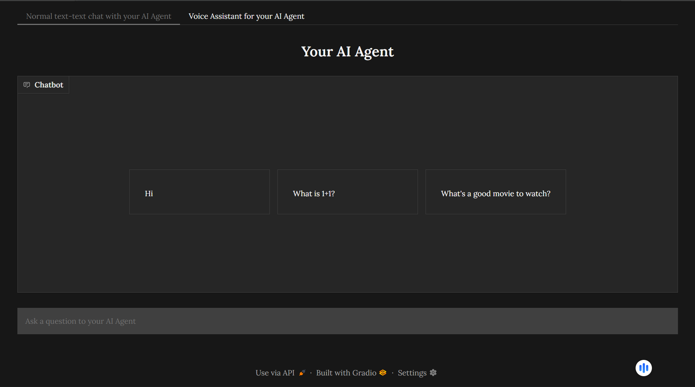
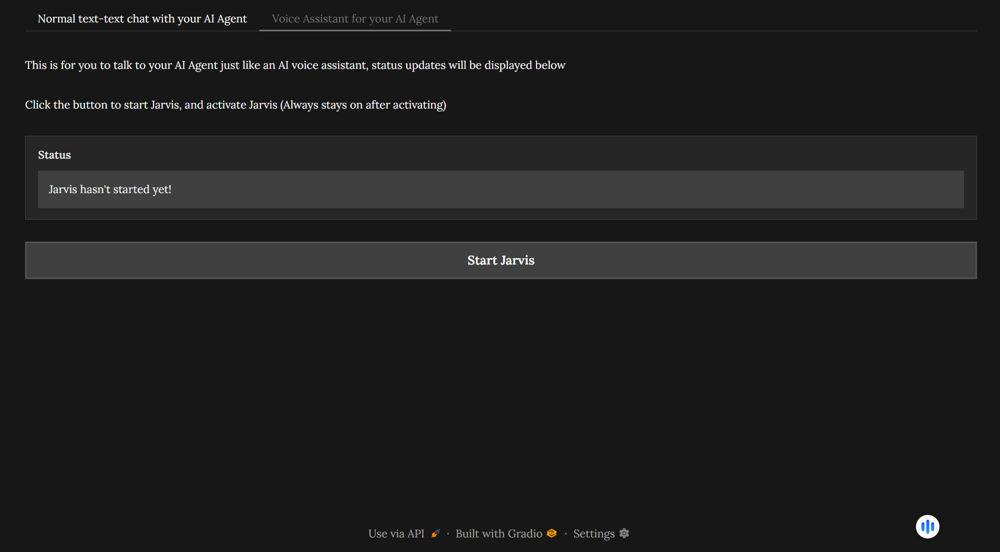
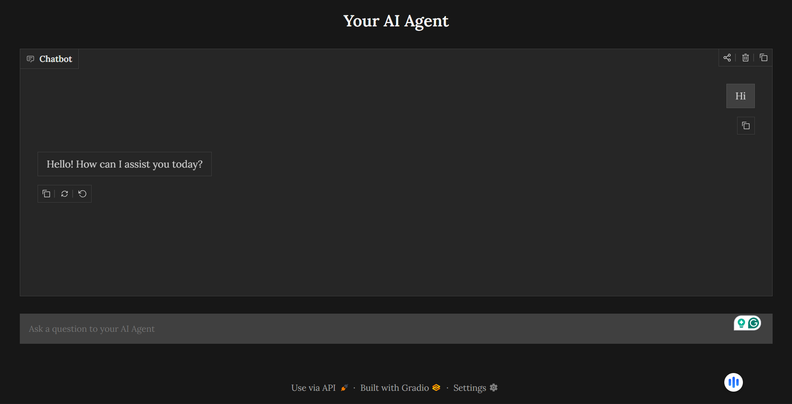

# Build Your Own AI Agent!

Hi, I built this GitHub repository to help people make their own custom AI Agent using Python and LangChain. You won't need anything except an API key for your AI provider (Not applicable for Ollama). Now go and build your own AI Agent! For Demo, scroll down.

> Don't have an API Key? Follow this tutorial to get a free Groq API key: [Yt link](https://www.youtube.com/watch?v=TTG7Uo8lS1M)

---

## Youtube Tutorial

If at any time something is confusing to you, or you want a quick YouTube tutorial on how to set this up, you can watch: https://youtu.be/mCsRr_MMr7w

## Quick Overview of Features

#### The AI Agent Includes:

- 4 different AI providers, for your personal needs (Groq, OpenAI, Anthropic, and Ollama)

- Easy to plug in tools for your AI (thanks to Langchain) with built in search tool using DuckDuckGoSearch

- Built in Chat History with Your Agent

- Customizable AI Personality/System Prompt

- Simple Chat to test your agent

#### The Optional Voice Assistant framework includes:

- whisper for STT

- edge_tts for TTS

- Jarvis Wake Word (Can be customized)

### Optional UI's features (you will need to set up Voice Assistant too, since the UI uses the voice assistant framework):

- Chat text-to-text with your agent

- Chat with your agent like a voice assistant, with status updates on the UI

#### IF you want to see how the optional UI/voice assistant looks, scroll down (Recommended, looks cool, and is very helpful). Now you're ready to start making your AI Agent. Follow this [readme](./HowTo/AI.md) to get started.

---

## Optional: Voice Assistant and UI (Recommended)

You start by setting up your AI Agent. Then you can set up an optional voice assistant framework for your AI Agent. You can stop there, or go even further and set up a UI for your AI Agent. Personally, I recommend setting it up; it looks really cool, and it's also helpful to have a UI to talk to your Agent with. If you do choose to set up the UI, you will also have to set up the Voice Assistant framework, since the UI uses the voice assistant framework to work. You won't need to do anything extra for the UI/voice assistant, except installing the requirements and running the Python file! Pictures of the UI are down below, but you do need to set up your AI Agent first before setting up the Voice Assistant and UI, so follow the [AI Agent readme](./HowTo/AI.md) first, then there will be a link at the bottom of that readme to set up the Voice Assistant and UI. UI pictures below:

---

---

---

### Demo

You can view a demo of this AI Agent with the UI here: https://huggingface.co/spaces/mynameisaryan/jarvis-ai-agent

## Notes/Extras

### Why I Built This?

I built this to give people a quick, simple tutorial on how to build an AI Agent using Python and Langchain without the hassle of figuring out all the small things. This is designed to be a starting point for people who want to build their own AI Agent.

### Links

- YouTube Channel: https://www.youtube.com/@RuCode

- LinkedIn: https://www.linkedin.com/in/aryan-jain-085401344/

- Gmail: aryanjain9818@gmail.com

- More Projects: Check my GitHub profile

### Optimization

To create a fast, efficient, and low-latency AI Agent, I implemented multiple optimizations, some of which are listed below:

| Technique | Category | Before (Unoptimized) | After (Optimized) | Improvement |
| :--- | :--- | :--- | :--- | :--- |
| **Inference Offloading (Groq)** | Latency / Speed | ~ 15.89 seconds | ~**2.33 seconds** | ~**85.3% Faster** |
| **Edge-TTS Cloud Synthesis** | Memory Usage | ~2.0 GB RAM | **< 200 MB RAM** | ~**95.1% Reduction** |

---

### Notes

- I made this to help people make AI Agents, so feel free to suggest any features/improvements along with what you made with this repository on my YouTube channel or LinkedIn.

- Have fun building your AI Agent!

